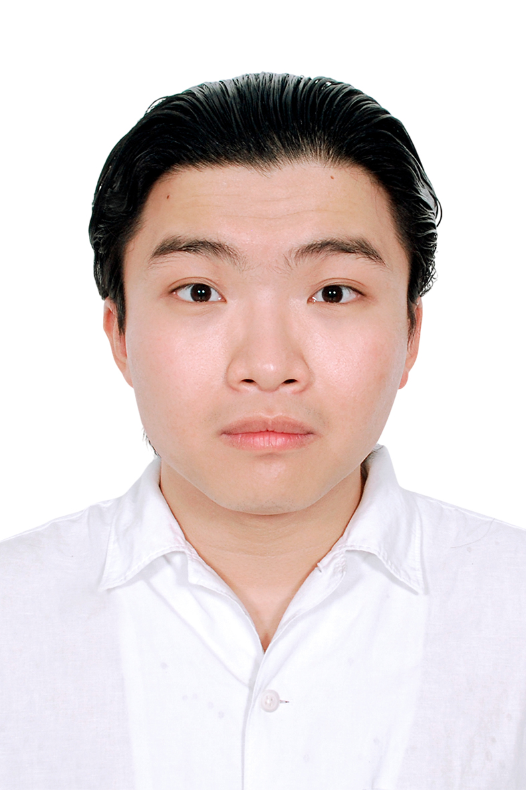

# Numerical Methods Coursework in MATLAB

  

This repository preserves coursework for Numerical Methods. Its main MATLAB GUI lets a reviewer select and run five prepared exercises; the accompanying PDF records the first in-class assignment.

## Evidence map

| Topic | Evidence |
|---|---|
| Fixed-point iteration | `x = sin(3x)` option in [`LuongHaiLong_22207056_BaiTap_2.m`](LuongHaiLong_22207056_BaiTap_2/LuongHaiLong_22207056_BaiTap_2.m). |
| Cholesky solution | Two supplied matrix-and-vector examples in the same GUI source. |
| Newton interpolation | Forward-difference interpolation with the supplied sample data. |
| Euler method | First-order ODE example `y' = y - x`. |
| Assignment record | [`LuongHaiLong_22207056_BaiTap_1.pdf`](LuongHaiLong_22207056_BaiTap_1.pdf), an 11-page submitted coursework document. |

## Run and review

1. Open MATLAB and set `LuongHaiLong_22207056_BaiTap_2/` as the current folder.
2. Run `LuongHaiLong_22207056_BaiTap_2`.
3. Select one prepared problem, inspect its input values, then compare the table and plot with the relevant numerical-method assumptions.
4. For convergence-sensitive cases, check the initial value, tolerance, step size, and conditioning before interpreting a result.

The original GUI labels are retained as supplied coursework source. The public README, captions, and release material use US English; no mathematical result is represented as production software or a general-purpose numerical library.

## Release

The [2026 portfolio refresh](https://github.com/lhlizdabezt/PhuongPhapTinh-Matlab/releases/tag/portfolio-refresh-2026-08-29) includes the tagged source archive, assignment PDF, and UI image. Details are recorded in [`RELEASE_NOTES.md`](RELEASE_NOTES.md).

## Profile and contact

[GitHub](https://github.com/lhlizdabezt) · [LinkedIn](https://www.linkedin.com/in/lhlizdabezt) · [Facebook](https://www.facebook.com/wageseadrake) · [Instagram](https://www.instagram.com/lhlizdabezt) · [YouTube](https://www.youtube.com/@lhlizdabezt) · [TikTok](https://www.tiktok.com/@wageseadrake) · [22207056@student.hcmus.edu.vn](mailto:22207056@student.hcmus.edu.vn) · [luonghailong.work@gmail.com](mailto:luonghailong.work@gmail.com) · [+84988114708](tel:+84988114708)
