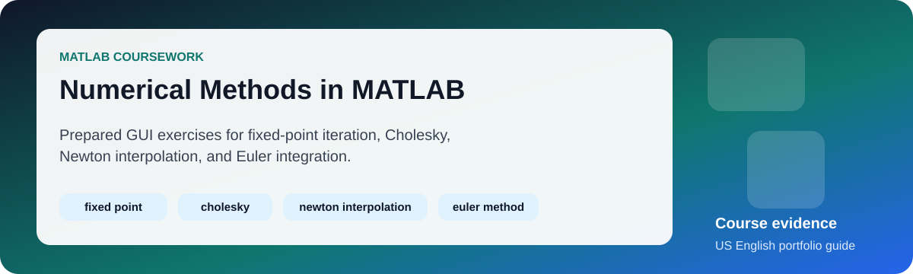
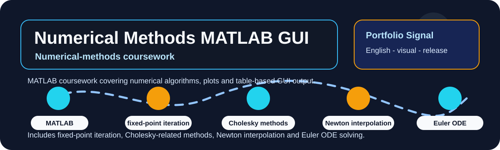
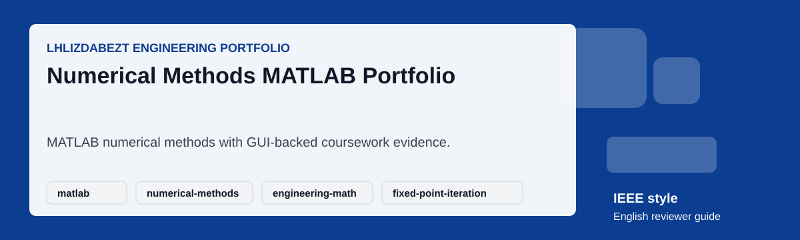

# Numerical Methods Coursework in MATLAB

  

  

  

This repository preserves coursework for Numerical Methods. Its main MATLAB GUI lets a reviewer select and run five prepared exercises; the accompanying PDF records the first in-class assignment.

## Evidence map

| Topic | Evidence |
|---|---|
| Fixed-point iteration | The GUI solves `x = sin(3x)` with the transformed iteration displayed in the prepared input. |
| Cholesky solution | Two supplied positive-definite matrix and vector examples. |
| Newton interpolation | Forward-difference interpolation using the supplied sample data. |
| Euler method | The first-order ODE example `y' = y - x`. |
| Assignment record | [`LuongHaiLong_22207056_BaiTap_1.pdf`](LuongHaiLong_22207056_BaiTap_1.pdf), the 11-page submitted coursework document. |

## Run and review

1. Open MATLAB and set `LuongHaiLong_22207056_BaiTap_2/` as the current folder.
2. Run `LuongHaiLong_22207056_BaiTap_2`.
3. Select one prepared problem, inspect its input values, then compare the table and plot with the relevant numerical-method assumptions.
4. For convergence-sensitive cases, check the initial value, tolerance, step size, and conditioning before interpreting a result.

## Scope and FAQ

**Is this a numerical-methods library?** No. It is preserved coursework with prepared examples rather than a general-purpose MATLAB package.

**Why is the portrait not shown here?** The original image remains in the source folder because the GUI loads it in its student-information panel. The README uses only project visuals.

**Can the original source be reused for submission?** No. See [`LICENSE`](LICENSE) for the academic-integrity notice and the ownership boundary for course prompts.

The original GUI labels are retained in Vietnamese as supplied coursework source. Public README text, captions, labels, and release notes use US English. No result is represented as production software or a general-purpose numerical library.

## Release

The [v1.0.1 portfolio release](https://github.com/lhlizdabezt/PhuongPhapTinh-Matlab/releases/tag/v1.0.1) contains the tagged source archive, assignment PDF, and line-free portfolio visuals. Details are in [`RELEASE_NOTES.md`](RELEASE_NOTES.md).

## Profile and contact

[GitHub](https://github.com/lhlizdabezt) · [LinkedIn](https://www.linkedin.com/in/lhlizdabezt) · [Facebook](https://www.facebook.com/wageseadrake) · [Instagram](https://www.instagram.com/lhlizdabezt) · [YouTube](https://www.youtube.com/@lhlizdabezt) · [TikTok](https://www.tiktok.com/@wageseadrake) · [22207056@student.hcmus.edu.vn](mailto:22207056@student.hcmus.edu.vn) · [luonghailong.work@gmail.com](mailto:luonghailong.work@gmail.com) · [+84988114708](tel:+84988114708)
